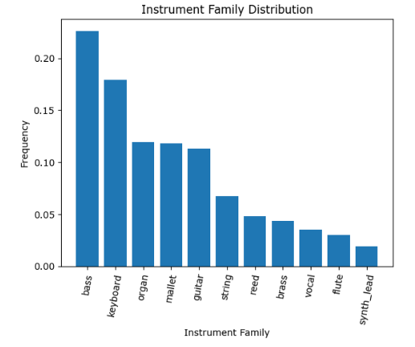
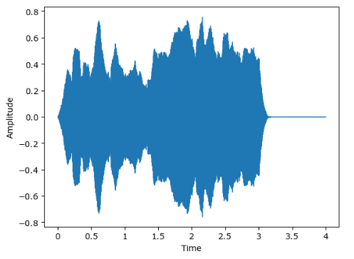

# Instrument-Classification

## Overview & Business Problem

The global smart home market is currently in a phase of rapid expansion, growing at a compound annual rate of 25%. This growth, underscored by the increasing integration of technology in everyday life, particularly in the field of music, is showing no signs of abating. Innovations such as AIVA, Google's AI Duet, and Amper Music exemplify the burgeoning relationship between music and technology.

As of 2023, smart home technologies have become increasingly prevalent in our daily lives, with about 15% of households worldwide adopting some form of smart home features. Despite this growth, there remain significant challenges in the realm of music production and learning:

High Cost of Professional Music Production: Professional music production often entails significant expenses, making it inaccessible for many aspiring musicians and producers.
Limited Accessibility to Live Music Collaboration: Collaborating with other musicians in a live setting can be challenging due to logistical, geographical, and financial constraints.
Challenges in Musical Practice and Learning: Many learners and practitioners of music face difficulties in terms of receiving real-time feedback, accessing quality instructional resources, and finding conducive environments for practice.
Project Aim and Functionality

In response to these challenges, this project aims to leverage the trend of smart home technology by developing a sophisticated feature for smart home devices. This feature is designed to detect when someone is playing a musical instrument and to classify the instrument type, identify the musical genre, and recognize specific notes being played. The ultimate goal is to create an interactive environment that not only recognizes but also harmonizes with the musician, thereby enhancing their playing experience.

This technology marks a significant advancement in smart homes, extending its application to fostering musical skills. It serves as a multifaceted tool for learning new instruments and songs, providing real-time feedback on tempo, tuning, and musical expression. By creating an immersive and responsive environment, this technology is poised to revolutionize musical education and practice, making it an invaluable asset for musicians of all levels.

## Data Sources

Nsynth DataSet
For this project, we utilized the Nsynth DataSet, a comprehensive collection curated by Magenta. Key features of this dataset include:

Size and Diversity: The dataset encompasses over 350,000 musical instances, each being a 4-second audio clip. This extensive collection ensures a diverse range of instruments and sounds.
Metadata: Accompanying the audio files is a detailed JSON file providing metadata for each clip. This metadata includes information about the instrument type, pitch, and other relevant characteristics.
Quality and Format: The audio clips are of high quality, suitable for sophisticated audio processing and analysis.

## Methods

To achieve this, first we needed to import the data, which was a little challenging due to the technological limitations we had at the moment.

By doing some Exploratory Data Analysis we could see that the instrument family was really unbalanced. We downsampled it to be able to better train our model.

### Audio Data & MFCCs

Our dataset is organized in a structured format, comprising JSON files that contain metadata about the audio tracks, and WAV files that hold the actual audio data. To process this data effectively, we have employed a two-pronged approach:

Short-Term Fourier Transform (STFT): Initially, we applied the Short-Term Fourier Transform to the audio files. STFT is a mathematical technique used to transform a series of time-based audio signals into a combination of their frequency components. This transformation is essential for analyzing the audio signal's frequency content over time, which is crucial for our subsequent processing steps.

Feature Extraction and Analysis:

Mel-Frequency Cepstral Coefficients (MFCCs): We extracted MFCCs from the transformed audio data. MFCCs are coefficients that collectively make up an MFC. They are derived from the real cepstral representation of the audio clip, where the frequency bands are not linear but distributed according to the mel scale. This scale approximates the human ear's response more closely than the linearly-spaced frequency bands, making MFCCs particularly useful for audio and speech processing tasks. These coefficients were then utilized to train various traditional machine learning models for the classification tasks.
Spectrogram Generation for CNN: Alongside, we converted the audio data into spectrograms. A spectrogram is a visual representation of the spectrum of frequencies of a signal as they vary with time. These spectrograms were used to feed a Convolutional Neural Network (CNN). CNNs are highly effective in image recognition and classification tasks; by converting audio into a visual format (spectrograms), we leveraged the CNN's capability to classify and analyze audio data.
By employing these methodologies, we aimed to accurately classify and analyze the audio data, harnessing both traditional machine learning techniques with MFCCs and advanced neural network approaches with CNNs on spectrograms.

The results can be seen in the first model notebook, with an accuracy of around 35%. it wasn't enough for what we were trying to achieve, we an established threshold of 95%.

### Spectrograms, Model Performance & Deployment

Model Performance and Deployment

The Convolutional Neural Network (CNN) we developed significantly outperformed our expectations, achieving a remarkable 98% accuracy on the training set and an even more impressive 99% accuracy on the test set. This performance not only surpassed our desired threshold but also validated the model's reliability and effectiveness, paving the way for its deployment.

Enhanced Real-World Application

In pursuit of our goal to facilitate real-world musical instrument recognition, we undertook additional steps to refine our model's capabilities. We recorded audio clips featuring various instrument families, including Piano, Flute, Strings, Vocal, and Brass. To process these recordings, we developed a Python script that performs the following functions:

File Conversion: The script accepts an input file in M4A format and converts it into a 4-second WAV file. This conversion is crucial for maintaining audio quality and consistency across different formats.

Spectrogram Transformation: Each converted WAV file is then transformed into a spectrogram. This visual representation of the audio is essential for our CNN to evaluate and classify the audio data.

Model Prediction: The script feeds the spectrogram into our trained CNN model, which then predicts the type of musical instrument being played in each 4-second audio segment.

Deployment and User Interface

Following the successful validation of our CNN model, we deployed it in an application designed for practical, real-world use. This app is capable of processing and predicting real-world audio files. It features a user-friendly interface that displays both the spectrograms and the model's predictions. This visual feedback not only offers insight into the model's classification process but also enhances the user experience by making the interaction more engaging and informative.

By integrating advanced machine learning techniques and user-centric design, our application stands as a testament to the practical application of AI in enhancing musical experience and education.

### Next Steps

* Create a docker container to make it easier to deploy and solve any environment issue we might face.
* Create the genre classification model.
* Create a note classification model.
* Create an AI generated musical harmonizer.

# Repository Architecture

├── Images

├── Data

├── Streamlit

├── .gitignore

├── Preprocessing.ipynb

├── first_model.ipynb

├── NN_models.ipynb

└── README.md
